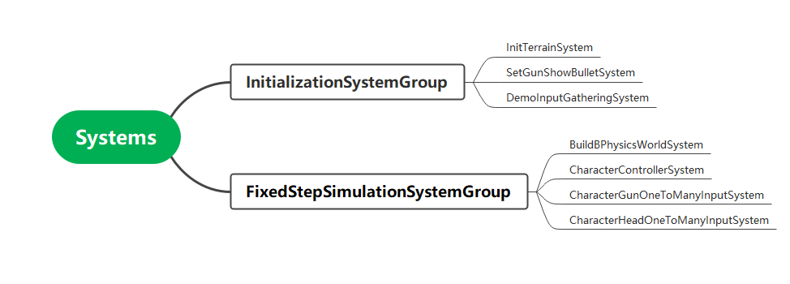
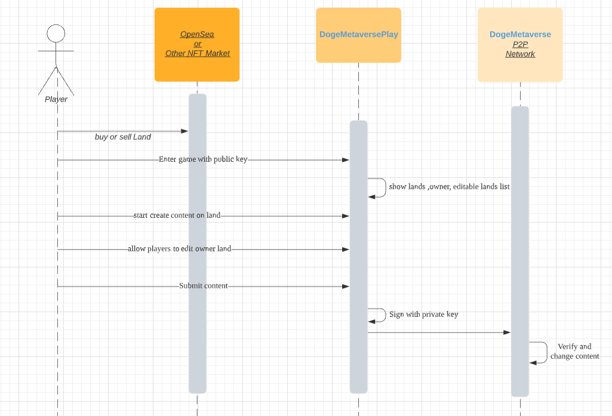

# DogeMetaversePlay
DogeMetaversePlay is a  sandbox  game based on Unity DOTs  
Project email address: y174389107@gmail.com

# World
Each world is based on a map of 65536 plots of land (256x256), each land is 50x50x512, Land is the physical space in the metaverse that players use to create games . The land is used to publish your game . Every piece of land has a set of pre-built terrain, but it can be transformed and modified by the user who owns it (or other players they invite). 

# Current Systems

## UpdateLandSystem
- [x] Add "CreateTerrain" entity when player enter land
- [ ] Add "RemoveTerrain" entity when player leave land

## InitTerrainSystem
- [x] Load or init Lands.

## SetGunShowBulletSystem
- [x] Show currently selected building box

## BuildBPhysicsWorldSystem
- [x] Collect boxes , calcute their nearby and hide invisible boxes 

## CharacterControllerSystem
- [x] Control chacater movement 

## CharacterGunOneToManyInputSystem
- [x] Build , destroy and change current selected building box

## CharacterHeadOneToManyInputSystem
- [x] Look up and down

# Other Systems

## Save System
- [x] Save lands

## RemoveTerrain System
- [ ] Remove lands

## Image wall generate system
Create wall from image
- [ ] Image Browser.
- [ ] Wall position editor.

# Sequence

